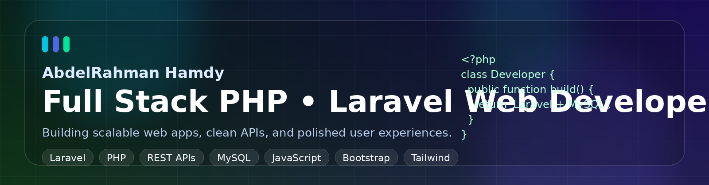

# 👋 Hi, I'm AbdelRahman Hamdy

    

  

## 📖 𝙰𝚋𝚘𝚞𝚝 𝙼𝚎

- 💼 Full Stack PHP / Laravel developer focused on building reliable, production-ready web applications.
- 🧠 Strong in backend architecture, RESTful API development, database design, and clean code practices.
- 🎨 I also care about the frontend experience, turning business requirements into smooth and responsive interfaces.
- ⚙️ Comfortable working across the full development cycle, from planning and development to testing and deployment.
- 🚀 I enjoy solving real problems with scalable solutions that are easy to maintain and improve over time.
- 📚 Always learning and refining my workflow to stay current with modern web development practices.

I’m a full stack web developer who enjoys transforming ideas into practical digital products. My main specialization is PHP and Laravel, where I build structured backend systems, secure APIs, and maintainable business logic. On the frontend side, I work on creating responsive, user-friendly interfaces that connect smoothly with the backend and deliver a polished experience. I care about code quality, performance, and clarity, and I like building applications that are not only functional today but also easy to extend tomorrow. My goal in every project is to create web solutions that feel stable, efficient, and thoughtfully engineered.

## 💻 Tech Stack

### Backend

### Frontend

### Tools & Workflow

## 🤝 Connect Me

  
  
  

## 📊 GitHub Stats

  
  

  

## 💬 My Preferred TechQutes

> “Good software should solve problems clearly, scale smoothly, and stay easy to maintain.”

  

